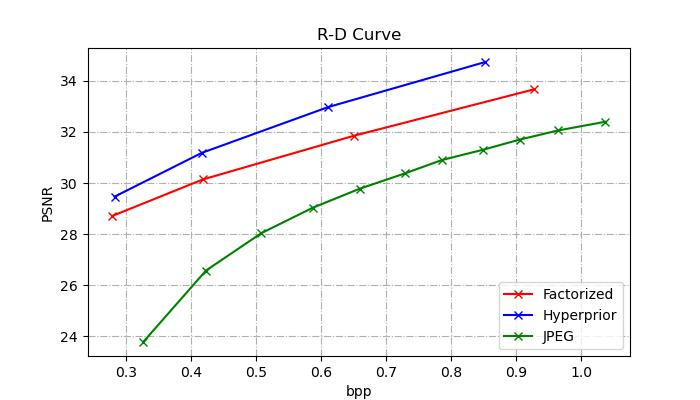

# Technical Report for Coding-Compression Summer Seminar

​                                                                          Group Members: Bojun Liu, Xinmin Feng, Bowei Kang, Ganlin Yang, Yuqi Li, Yiming Wang

## Part 1: Model Architectures

### 1.1 Factorized


### 1.2 Hyperprior


### 1.3 Joint Autoregressive Hierarchical Priors


### 1.4 Checkerboard Autoregressive


## Part 2: Training/Testing Process

### 2.1 Training process

For training, we used the vimeo-90k dataset, and randomly cropped the pictures with the size of 256×256. Models were trained with a batch size of 64, optimized using Adam. The loss function is set as: 
$$
Loss=\lambda*255^2*D+R
$$
where D denotes mean-square error(MSE), R denotes the estimated code rate, and λ is set as:
$$
\lambda\in{0.0067,\ 0.013,\ 0.025,\ 0.0483}
$$
As for Hyperprior models and Factorized models, the neural networks' channel number N is set as 128 and M is set as 192 for two lower-rate models; N is set as 192 and M is set as 320 for two higher-rate models. As for JointAutoregressive models and CheckerboardAutogressive models, the neural networks' channel number N is set as 192 and M is set as 192 for two lower-rate models; N is set as 192 and M is set as 320 for two higher-rate models.

Due to lack of experience with deep learning training, we tried different kinds of ways to adjust the learning rate and epoch number. First, as for Hyperprior models, we used the `lr_scheduler.MultiStepLR` method in the `torch.optim` package, and set milestones=[40, 90, 140] (epochs). This method allows the learning rate begins with a value of 1e-4, and divided by 2 when meet the milestones. As for Factorized models, we used `lr_scheduler.ReduceLROnPlateau` method, letting the learning rate reduce by half when loss has stopped reducing. Above Hyperprior models and Factorized models were trained for 200 epochs.

After trying `lr_scheduler.ReduceLROnPlateau` method more powerful, as for JointAutoregressive models and CheckerboardAutogressive models' training, we all used this method for learning rate adjustment. These models were trained for 250 epochs.

The command for training is as below:

```py
python train.py 
--dataset # path to training dataset
--test_dataset # path to testing dataset
--lmbda # weight for distortion loss
--lr # initial learning rate
--batch_size # training batch size
--test_batch_size # testing batch size
--epoch # training epoches
--model_name # arguments to distinguish different mode, selected from['FactorizedPrior','Hyperprior', 'JointAutoregressiveHierarchicalPriors', 'CheckerboardAutogressive']
--exp_version # experiment version ID, assign a different value each training time to aviod overwrite
--gpu_id # pass '0 1 2' for 3 gpus as example, pass '0' for single gpu 
--code_rate # choose from 'low' or 'high'
```

### 2.2 Testing process

To test Factorized models:

```python
python test.py --model_name Factorized --epoch_num 199
```

To test Hyperprior models:

```python
python test.py --model_name Hyperprior --epoch_num 199
```

To test JointAutoregressive models:

```python
python test.py --model_name JointAutoregressiveHierarchicalPriors --epoch_num 249
```

To test CheckerboardAutogressive models:

```python
python test.py --model_name CheckerboardAutogressive --epoch_num 249
```

## Part 3: Testing results

The reproduced RD-curve is plotted below:



Specifically, the detailed results are recorded as:

| TRUE   | num_pixels(input) | num_pixels(output) | bits        | bpp         | psnr        | time(enc)   | time(dec)   |
| ------ | ----------------- | ------------------ | ----------- | ----------- | ----------- | ----------- | ----------- |
| 0.0067 | 393216            | 1                  | 111120.6667 | 0.282583333 | 29.46871132 | 0.555583333 | 0.395875    |
| 0.013  | 393216            | 1                  | 163870      | 0.416666667 | 31.18252472 | 0.493041667 | 0.521916667 |
| 0.025  | 393216            | 1                  | 240186.3333 | 0.610958333 | 32.97386499 | 0.869958333 | 0.805       |
| 0.0483 | 393216            | 1                  | 335234.6667 | 0.852583333 | 34.73847335 | 0.985458333 | 0.861291667 |

## Part 4: Model Complexity

We use ***thop*** package to calculate model parameters(Params) and Multiply–Accumulate Operations(MACs) :

| Methods                                  | Params  | MACs     |
| ---------------------------------------- | ------- | -------- |
| Factorized                               | 2.887M  | 771.752G |
| Hyperprior                               | 2.887M  | 771.752G |
| Joint Autoregressive Hierarchical Priors | 12.053M | 1.730T   |
| Checkerboard Autoregressive              | 12.053M | 1.747T   |

