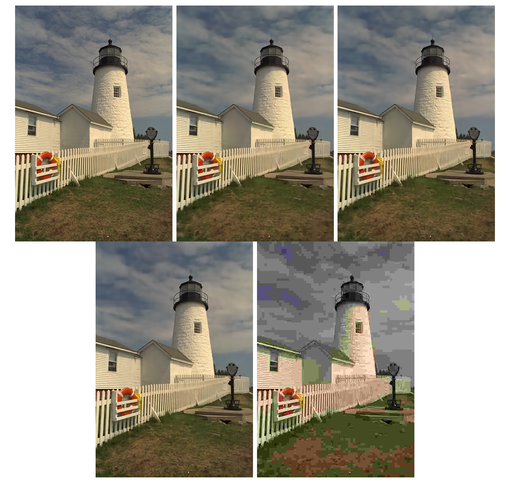

# Technical Report for Coding-Compression Summer Seminar

​                                                                          Group Members: Bojun Liu, Xinmin Feng, Bowei Kang, Ganlin Yang, Yuqi Li, Yiming Wang

## Part 1: Model Architectures

### 1.1 Factorized
This subsection reproduces [END-To-END Optimized Image Compression](https://arxiv.org/abs/1611.01704), In this work, an end-to-end image compression framework including analysistransformation, uniform Quantizer and synthesizer is proposed.  The nonderivable steps such as quantization and discrete entropy are relaxed into derivable steps using the form of proxy functions. This work also proves that under certain conditions, the relaxed loss function in this paper is formally similar to the likelihood of a variational Autoencoder.

#### 1.1.1 Previous Work

The data flow diagram of the working end-to-end image compression framework is shown below


Where, X and $\hat{x}$are the original image and the reconstructed image, respectively, and $G_A $, $G_s $and $G_p $represent the analysis transform (encoding), synthesis transform (decoding) and perceptual domain transform, respectively. In the actual implementation, the structure of $G_A $and $G_S $is symmetric, and is mainly composed of alternating splices of the convolutional layer and the Generalized Service Normalization layer.


The above figure shows the transformation steps of $G_A $and $G_s $, and indicates the number of parameters that need to be optimized for each layer. The set of parameters that need to be optimized for analytical transformation and synthetic transformation are denoted as $\phi$and $\theta$respectively, corresponding to $y=g_a(x;\theta)$ and $\hat{x}=g_s(\hat{y};\theta)$.


#### 1.1.2 Our work


In reproducing the paper, we draw on the progress of subsequent work and the requirements of the current task, **removing Perceptron Transformation**. In addition, in this paper, the training process of the realization of the basic follow [compressAI](https://interdigitalinc.github.io/CompressAI/), the test code part on the basis of compressAI realized further simplification and improvement, Especially arithmetic entropy encoder and code stream design.


Arithmetic entropy codec is ETH Zurich open source based on the study of nondestructive arithmetic encoder [torchac](https://pypi.org/project/torchac), the input parameter is the CDF of the symbol to be encoded and the corresponding symbol. Therefore, the code stream is designed into two parts. The first part is the output of arithmetic entropy encoder, and the second part is the minimum and maximum values of symbols to be encoded, which is more concise than the implementation of compressAI.

The training and testing flow chart of the Factorized Prior model designed in this project is shown below:


#### 1.1.3  nonparametric probability density model

In this work, we use a multivariable nonparametric probabilistic model to model the hidden layer variables, and here we illustrate the basic principle of the probabilistic model in the simple case of univariate.

We first define the probability density $P $and the cumulative probability density $C $, which are decomposed into the following form

$$\begin{equation}c=f_{K} \circ f_{K-1} \cdots f_{1}\end{equation}$$

$$\begin{equation}p=f_{K}^{\prime} \cdot f_{K-1}^{\prime} \cdots f_{1}^{\prime}\end{equation}$$

Among them, the $f_K$ for matrix $\mathbb{R}^{d_k}\to\mathbb{R}^{r_k}$, and $f'_K$ first order partial derivatives of the (Jacobi matrix), $\ circ $said matrix multiplication. Here, to ensure that the probability density follows the definition (non-negative between 0 and 1), the elements of the Jacobi matrix are required to be non-negative.

$F_k$is designed as follows

$$\begin{equation}f_{k}(\boldsymbol{x})=g_{k}\left(\boldsymbol{H}^{(k)} \boldsymbol{x}+\boldsymbol{b}^{(k)}\right)
\quad\quad \leq k<K\end{equation}$$


$$\begin{equation}f_{k}(\boldsymbol{x})=\text{sigmoid}\left(\boldsymbol{H}^{(k)} \boldsymbol{x}+\boldsymbol{b}^{(k)}\right)\quad\quad k=K\end{equation}$$

Where $g_k$is designed in the following form

$$g_{k}(\boldsymbol{x})=\boldsymbol{x}+\boldsymbol{a}^{(k)} \odot \tanh (\boldsymbol{x})$$

Where $\odot$ represents the Elementwise multiplication, and the plus or minus of $a^{(k)}$ can be used to control whether to scale the space around the null.

The overall operation is as follows

$$\begin{aligned}
f_{k}^{\prime}(\boldsymbol{x}) &=\operatorname{diag} g_{k}^{\prime}\left(\boldsymbol{H}^{(k)} \boldsymbol{x}+\boldsymbol{b}^{(k)}\right) \cdot \boldsymbol{H}^{(k)} \\
g_{k}^{\prime}(\boldsymbol{x}) &=1+\boldsymbol{a}^{(k)} \odot \tanh ^{\prime}(\boldsymbol{x}) \\
f_{K}^{\prime}(\boldsymbol{x}) &=\operatorname{sigmoid}^{\prime}\left(\boldsymbol{H}^{(K)} \boldsymbol{x}+\boldsymbol{b}^{(K)}\right) \cdot \boldsymbol{H}^{(K)}
\end{aligned}$$

Here, to restrict the Jacobi matrix to be nonnegative and $a^{(k)}$ to be greater than -1, parameter renormalization is required:

$$\begin{aligned}
\boldsymbol{H}^{(k)} &=\operatorname{softplus}\left(\hat{\boldsymbol{H}}^{(k)}\right) \\
\boldsymbol{a}^{(k)} &=\tanh \left(\hat{\boldsymbol{a}}^{(k)}\right)\end{aligned}$$

The following figure shows that the three-layer non-parametric probability density model $P $is used in this paper to fit a mixed Gaussian distribution, and the fitting effect is very good. The gray line shows the convergence process of the fitting


In this work, we set K=4 all the time and achieved as good a performance as the piecewise linear function, thanks to the fact that it is more friendly to implement this operation based on an automatic differentiator.

### 1.2 Hyperprior

This subsection reproduces [Variational Image Compression with a scale hyperprior](), which follows the work of FactorizedPrior and proposes Hyperprior to describe Image side information. Based on HyperPrior, the hidden layer variable $y$is modeled as a Gaussian distribution with mean zero and variance $\ Sigma $, thus realizing the dynamic adjustment of the probability model with the content of the picture.

#### 1.2.1 Previous Work

The researchers first performed a pre-experiment by visualizing the Factorized Prior's working hidden layer variable $y$ (second from left) and the variance predicted by HyperPrior (second from right) and the hidden layer variable $y$ after variance removal. The results are shown below.


It can be seen that 1) factorized Prior did not fully learn part of texture and edge information, so the spatial coupling of discrete signals could not be completely removed. 2)$\hat{y}$ after removing the spatial coupling basically follows $\mathcal{N}(0,I)$.

Based on this observation, researchers have proposed an end-to-end image compression framework with HyperPrior


Our formulation is the formulation of codec on latent representation $\hat{y}$, and the formulation of the process can be written as follows:

$$\begin{equation}
\begin{aligned}
\mathbb{E}_{\boldsymbol{x} \sim p_{\boldsymbol{x}}} D_{\mathrm{KL}}\left[q \| p_{\tilde{\boldsymbol{y}}, \tilde{\boldsymbol{z}} \mid \boldsymbol{x}}\right]=\mathbb{E}_{\boldsymbol{x} \sim p_{\boldsymbol{x}}} \mathbb{E}_{\tilde{\boldsymbol{y}}, \tilde{\boldsymbol{z}} \sim q}\left[\log q(\tilde{\boldsymbol{y}}, \tilde{\boldsymbol{z}} \mid \boldsymbol{x})-\log p_{\boldsymbol{x} \mid \tilde{\boldsymbol{y}}}(\boldsymbol{x} \mid \tilde{\boldsymbol{y}})\right.\\
\left.-\log p_{\tilde{\boldsymbol{y}} \mid \tilde{\boldsymbol{z}}}(\tilde{\boldsymbol{y}} \mid \tilde{\boldsymbol{z}})-\log p_{\tilde{\boldsymbol{z}}}(\tilde{\boldsymbol{z}})\right]+\text { const. }
\end{aligned}
\end{equation}$$


It is worth noting that the number of channels needs to be adjusted manually according to the complexity of the task, and in the paper, the researchers recommend $N=128\quad M=192$for five low $\lambda$values and $N=192\quad M=320$for three high $\lambda$values.

#### 1.2.2 Our work

Like FactorizedPrior, we still use Torchac as the entropy encoder, and like that, we add the bitstream and symbol bits to the bitstream for the hidden layer variable $\hat{z}$.


The training framework designed in this project is shown in the figure below


Loss function is designed as

$$Loss=\sum_i{p_{\hat{y}_i}}(\hat{y}_i)+\sum_j{p_{\hat{z}_j}}(\hat{z}_j)+\lambda d(x,\hat{x})$$


### 1.3 Joint Autoregressive Hierarchical Priors
- ##### Fig


- ##### Features

  Based on the structure of the Hyperprior model, the context module and the entropy module are introduced. The hyperprior network obtain the parameter $\psi$ and the context module obtain the parameter $\Phi$, then concatenate the two parameters and enter into the entropy module to get the probability parameter of each element in $\hat{y}$, spacifically, when the $\hat{y}$ elements are considered to be subject to mutually independent Gaussian distributions, the probability parameters are the mean and the variance scales respectively.

  Due to the introduction of the context module, each element depends on each other during the decoding process, that is, the elements in the back position need to wait for the elements in the front position to be decoded before they can be decoded. There is a sequence in time, so a strict serial decoding method is required. The time complexity of decoding is greatly increased.

  The context module also brings gains in performance, further reducing the spatial redundancy between pixels, and surpassing the BPG coding method in PSNR and MS-SSIM evaluation indicators.

- ##### compress&decompress

  The range-coder is used to encode and decode $\hat{y}$. Encoding provides two ways of parallel compress and serial compress, and there is only one way of serial decompress for decoding. According to the description in Compressai, the model needs to run on the cpu during the test, but in the actual test, it is found that the test on the cpu is not stable, and there will be garbled decoding, however,  the test performance on gpu is very stable with using  `torch.use_deterministic_algorithms(True)` statement. The current training results are normal, but the test results on the Kodak dataset still have the problem that the bpp is too large. It is suspected that the problem lies in the inaccurate estimation of the probability of encoding elements by the entropy model in the actual encoding process and the instability of the range-coder.We will continue to find the location.


### 1.4 Checkerboard Autoregressive

## Part 2: Training/Testing Process

### 2.1 Training process

For training, we used the vimeo-90k dataset, and randomly cropped the pictures with the size of 256×256. Models were trained with a batch size of 64, optimized using Adam. The loss function is set as: 

$$Loss=\lambda*{255^2}*D+R $$
where D denotes mean-square error(MSE), R denotes the estimated code rate, and λ is set as:
$$\lambda\in{0.0067,\ 0.013,\ 0.025,\ 0.0483}$$
As for Hyperprior models and Factorized models, the neural networks' channel number N is set as 128 and M is set as 192 for two lower-rate models; N is set as 192 and M is set as 320 for two higher-rate models. As for JointAutoregressive models and CheckerboardAutogressive models, the neural networks' channel number N is set as 192 and M is set as 192 for two lower-rate models; N is set as 192 and M is set as 320 for two higher-rate models.

Due to lack of experience with deep learning training, we tried different kinds of ways to adjust the learning rate and epoch number. First, as for Hyperprior models, we used the `lr_scheduler.MultiStepLR` method in the `torch.optim` package, and set milestones=[40, 90, 140] (epochs). This method allows the learning rate begins with a value of 1e-4, and divided by 2 when meet the milestones. As for Factorized models, we used `lr_scheduler.ReduceLROnPlateau` method, letting the learning rate reduce by half when loss has stopped reducing. Above Hyperprior models and Factorized models were trained for 200 epochs.

After trying `lr_scheduler.ReduceLROnPlateau` method more powerful, as for JointAutoregressive models and CheckerboardAutogressive models' training, we all used this method for learning rate adjustment. These models were trained for 250 epochs.

The command for training is as below:

```py
python train.py 
--dataset # path to training dataset
--test_dataset # path to testing dataset
--lmbda # weight for distortion loss
--lr # initial learning rate
--batch_size # training batch size
--test_batch_size # testing batch size
--epoch # training epoches
--model_name # arguments to distinguish different mode, selected from['FactorizedPrior','Hyperprior', 'JointAutoregressiveHierarchicalPriors', 'CheckerboardAutogressive']
--exp_version # experiment version ID, assign a different value each training time to aviod overwrite
--gpu_id # pass '0 1 2' for 3 gpus as example, pass '0' for single gpu 
--code_rate # choose from 'low' or 'high'
```

### 2.2 Testing process

To test Factorized models:

```python
python test.py --model_name Factorized --epoch_num 199
```

To test Hyperprior models:

```python
python test.py --model_name Hyperprior --epoch_num 199
```

To test JointAutoregressive models:

```python
python test.py --model_name JointAutoregressiveHierarchicalPriors --epoch_num 249
```

To test CheckerboardAutogressive models:

```python
python test.py --model_name CheckerboardAutogressive --epoch_num 249
```

## Part 3: Testing results

### 3.1 R-D Curve

The R-D Curve is plotted below:


We can see that our models both provide better rate-distortion performance compared to JPEG. What's more, our Hyperprior model can provide better performance than JPEG2000. Compared with compressai official results, our models get 1dB lower than the official results at same bit rates.

Specifically, the Factorized models' detailed results are recorded as:

| lmbda  | num_pixels | bits     | bpp      | psnr     | time(enc) | time(dec) |
| ------ | ---------- | -------- | -------- | -------- | --------- | --------- |
| 0.0067 | 393216     | 109462   | 0.278833 | 28.71093 | 0.305292  | 0.32475   |
| 0.013  | 393216     | 164219   | 0.418083 | 30.14009 | 0.377417  | 0.386792  |
| 0.025  | 393216     | 255458   | 0.650125 | 31.84871 | 0.383417  | 0.357583  |
| 0.0483 | 393216     | 364205.3 | 0.92675  | 33.6627  | 0.230708  | 0.234292  |

The Hyperprior models' detailed results are recorded as:

| lmbda  | num_pixels | bits     | bpp      | psnr     | time(enc) | time(dec) |
| ------ | ---------- | -------- | -------- | -------- | --------- | --------- |
| 0.0067 | 393216     | 111120.7 | 0.282583 | 29.46871 | 1.035042  | 0.832708  |
| 0.013  | 393216     | 163870   | 0.416667 | 31.18252 | 1.100542  | 0.912625  |
| 0.025  | 393216     | 240186.3 | 0.610958 | 32.97386 | 1.117917  | 0.772125  |
| 0.0483 | 393216     | 335234.7 | 0.852583 | 34.73847 | 1.202125  | 1.087917  |

### 3.2 Subjective quality evaluation

We show an image(take kodak-19 as an example) compressed using our method optimized for a low value of λ (and thus, a low bit rate), compared to JPEG image compressed at equal or greater bit rates.



The above images from left to right are the original kodak-19 image, image compressed using our Factorized model, image compressed using our Hyperprior model, and JPEG compressed image. The detailed bpp and psnr are as below:

| Methods    | bpp   | psnr   |
| ---------- | ----- | ------ |
| Factorized | 0.250 | 28.496 |
| Hyperprior | 0.255 | 29.357 |
| JPEG       | 0.221 | 23.890 |

At similar bit rates, our method provides the higher visual quality on the kodak-19 image. However, for some detailed parts of the original image, such as the textures of the sky and the fence, our Factorized model restores more blur, and the Hyperprior model retains some textures, but a little blur still exists. JPEG shows severe blocking artifacts at this bit rate.

## Part 4: Model Complexity

We use ***thop*** package to calculate model parameters(Params) and Multiply–Accumulate Operations(MACs) :

| Methods                                  | Params  | MACs     |
| ---------------------------------------- | ------- | -------- |
| Factorized                               | 2.887M  | 72.352G |
| Hyperprior                               | 4.969M  | 74.014G |
| Joint Autoregressive Hierarchical Priors | 12.053M | 162.232G   |
| Checkerboard Autoregressive              | 12.053M | 163.792G   |

