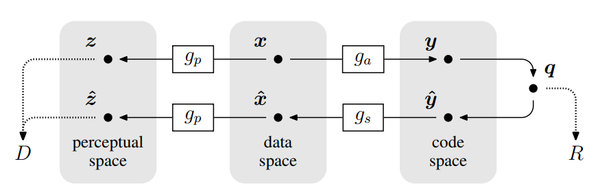
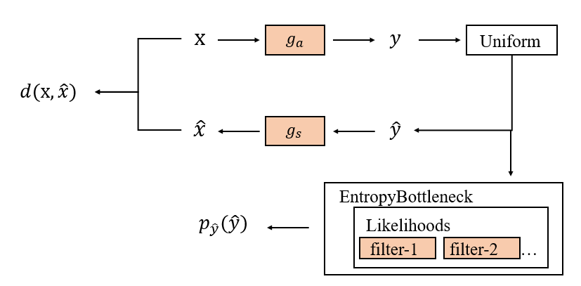
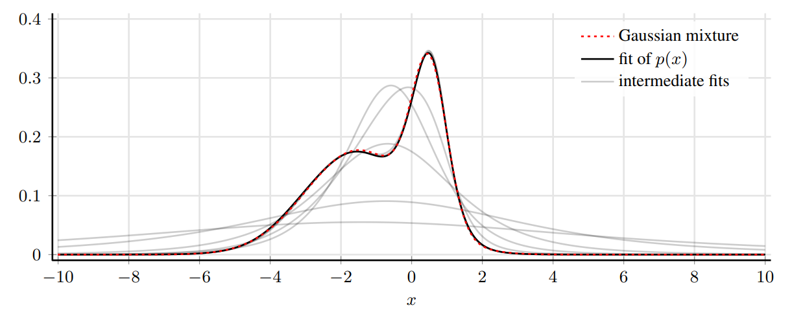
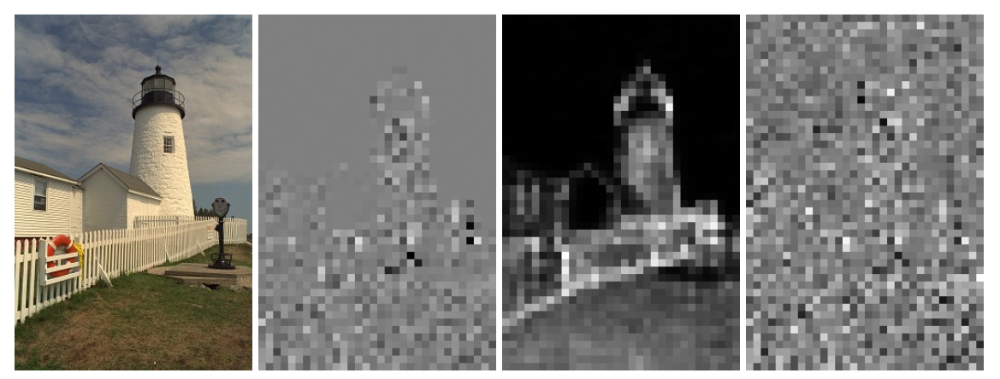
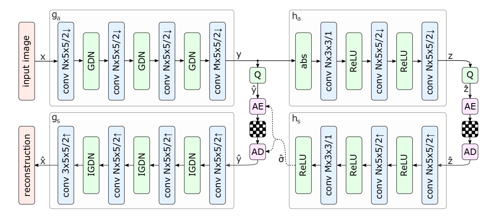

# Technical Report for Coding-Compression Summer Seminar 2022
小组成员: Bojun Liu, Xinmin Feng, Bowei Kang, Ganlin Yang, Yuqi Li, Yiming Wang

## Part 1: Model Architectures

### 1.1 Factorized Prior

该小节复现了[END-To-END optimized image compression](https://arxiv.org/abs/1611.01704)，该工作提出了一套包含分析变换（analysis　transformation）、均匀量化器（uniform quantizer）和综合变换（synthesis　transformation）的端到端图像压缩框架，并使用代理函数的形式将量化和离散熵等不可导的步骤松弛为可导的步骤。该工作也证明，在特定条件下，本文的松弛化后的损失函数在形式上类似于变分自编码器（variable autoencoder）的似然。
#### 1.1.1 Previous Work

该工作的端到端图像压缩框架的数据流程图如下图所示



其中，x和$\hat{x}$分别是原图像和重建图像，$g_a$、$g_s$和$g_p$分别表示分析变换（编码）、综合变换（解码）和感知域变换。在具体实现中，$g_a$ 和$g_s$ 结构对称，主要由卷积层和GDN层（Generalized Divisive Normalization）交替拼接而成。


上图展示了$g_a$和$g_s$的变换步骤，并注明了每层需要优化的参数量，而分析变换和综合变换各自所需要优化的参数集合记为$\phi$和$\theta$，对应 $y=g_a(x;\theta)$ 和$\hat{x}=g_s(\hat{y};\theta)$。

#### 1.1.2 Our work

我们在复现论文时借鉴了后续工作的进展，以及当前任务的需求，**删除了感知变换**（Perceptron Transformation）。此外，本文的训练流程基本沿袭[compressAI](https://interdigitalinc.github.io/CompressAI/)的实现，测试代码部分在compressAI的基础上实现了进一步的简化和改进，尤其是算数熵编码器和码流设计。

算数熵编解码器是 ETH Zürich 开源的基于学习的无损算术编码器[torchac](https://pypi.org/project/torchac
)，输入参数为 待编码符号 和 对应符号的 CDF。因此我们将码流设计为两部分，第一部分是算数熵编码器的输出，第二部分是待编码符号的最小值和最大值（可配合Prior得到CDF），相较于compressAI的实现更加简洁。

本项目所设计的Factorized Prior模型的训练和测试流程图如下图所示：




#### 1.1.3 单变量非参数概率密度模型
在该工作中，我们使用多变量的非参数概率模型对隐藏层变量进行建模，在此以单变量的简单情形说明该概率模型的基本原理。

首先定义概率密度$p$和累积概率密度$c$，并被分解为以下形式
$$
\begin{equation}
c=f_{K} \circ f_{K-1} \cdots f_{1}
\end{equation}
$$

$$
\begin{equation}
p=f_{K}^{\prime} \cdot f_{K-1}^{\prime} \cdots f_{1}^{\prime}
\end{equation}
$$

其中，$f_K$为矩阵$\mathbb{R}^{d_k}\to\mathbb{R}^{r_k}$，而$f'_K$为$f_K$的一阶偏导（雅各比矩阵），$\circ$表示矩阵乘法。此处，为保证概率密度服从定义（位于0-1之间的非负数），要求雅各比矩阵的元素为非负数。

$f_k$被设计为如下的形式
$$
f_{k}(\boldsymbol{x})=g_{k}\left(\boldsymbol{H}^{(k)} \boldsymbol{x}+\boldsymbol{b}^{(k)}\right)
\quad\quad1 \leq k<K\\
$$

$$
f_{k}(\boldsymbol{x})=\text{sigmoid}\left(\boldsymbol{H}^{(k)} \boldsymbol{x}+\boldsymbol{b}^{(k)}\right)
\quad\quad  k=K
$$

其中的$g_k$被设计为如下形式
$$
g_{k}(\boldsymbol{x})=\boldsymbol{x}+\boldsymbol{a}^{(k)} \odot \tanh (\boldsymbol{x})
$$
其中，$\odot$表示elementwise乘法，$a^{(k)}$的正负可用来控制是否伸缩零值附近的空间。

整体的运算如下所示
$$
\begin{aligned}
f_{k}^{\prime}(\boldsymbol{x}) &=\operatorname{diag} g_{k}^{\prime}\left(\boldsymbol{H}^{(k)} \boldsymbol{x}+\boldsymbol{b}^{(k)}\right) \cdot \boldsymbol{H}^{(k)} \\
g_{k}^{\prime}(\boldsymbol{x}) &=1+\boldsymbol{a}^{(k)} \odot \tanh ^{\prime}(\boldsymbol{x}) \\
f_{K}^{\prime}(\boldsymbol{x}) &=\operatorname{sigmoid}^{\prime}\left(\boldsymbol{H}^{(K)} \boldsymbol{x}+\boldsymbol{b}^{(K)}\right) \cdot \boldsymbol{H}^{(K)}
\end{aligned}
$$
此处为限制雅各比矩阵非负以及$a^{(k)}$大于-1，需要进行参数重整：
$$
\begin{aligned}
\boldsymbol{H}^{(k)} &=\operatorname{softplus}\left(\hat{\boldsymbol{H}}^{(k)}\right) \\
\boldsymbol{a}^{(k)} &=\tanh \left(\hat{\boldsymbol{a}}^{(k)}\right)
\end{aligned}
$$
下图展示了本文使用三层的非参数概率密度模型$p$拟合一个混合高斯分布，并实现了很好的拟合效果，灰色线条展示了拟合的收敛过程



在本文中，始终设置K=4，并实现了和分段线性函数一样好的性能，同时归于基于自动微分器实现该操作更加友好。

### 1.2 Hyperprior
该小节复现了[Variational Image Compression with a scale hyperprior]()，该工作沿袭FactorizedPrior的工作，提出了描述图像边信息的HyperPrior，并基于HyperPrior将隐藏层变量$y$建模为均值为零、方差为$\sigma$的高斯分布，从而实现了概率模型随图片内容的动态调整。


#### 1.2.1 Previous Work

研究人员首先进行了预实验，将Factorized Prior的工作的隐藏层变量$y$可视化（左2），并将HyperPrior预测的方差（右2）和经过去除方差后的隐藏层变量$y$可视化，结果如下图所示；



可见，1）factorized prior确实没有完全学习到部分纹理和边缘信息，从而不能完全去除离散信号的空间耦合；2）去除空间耦合后的$\hat{y}$基本服从$\mathcal{N}(0,I)$。

基于这种观察，研究人员提出了带有HyperPrior的端到端图像压缩框架



具体操作是在latent representation \hat{y}上又进行了一次编解码，得到\hat{z}，该过程的formulation可表示为：

$$
\begin{equation}
\begin{aligned}
\mathbb{E}_{\boldsymbol{x} \sim p_{\boldsymbol{x}}} D_{\mathrm{KL}}\left[q \| p_{\tilde{\boldsymbol{y}}, \tilde{\boldsymbol{z}} \mid \boldsymbol{x}}\right]=\mathbb{E}_{\boldsymbol{x} \sim p_{\boldsymbol{x}}} \mathbb{E}_{\tilde{\boldsymbol{y}}, \tilde{\boldsymbol{z}} \sim q}\left[\log q(\tilde{\boldsymbol{y}}, \tilde{\boldsymbol{z}} \mid \boldsymbol{x})-\log p_{\boldsymbol{x} \mid \tilde{\boldsymbol{y}}}(\boldsymbol{x} \mid \tilde{\boldsymbol{y}})\right.\\
\left.-\log p_{\tilde{\boldsymbol{y}} \mid \tilde{\boldsymbol{z}}}(\tilde{\boldsymbol{y}} \mid \tilde{\boldsymbol{z}})-\log p_{\tilde{\boldsymbol{z}}}(\tilde{\boldsymbol{z}})\right]+\text { const. }
\end{aligned}
\end{equation}
$$

值得注意的是，通道数需要根据任务的复杂程度进行手动调节，在文章中，研究人员推荐，对于5个低$\lambda$值，$N=128\quad M=192$，对于3个高$\lambda$值，$N=192\quad M=320$.

#### 1.2.2 Our work

与FactorizedPrior类似，我们仍然使用torchac作为熵编码器，与之类似，我们在码流中增加了针对隐藏层变量$\hat{z}$的码流和符号位。

本项目所设计的训练框架如下图所示


损失函数设计为
$$
Loss=\sum_i{p_{\hat{y}_i}}(\hat{y}_i)+\sum_j{p_{\hat{z}_j}}(\hat{z}_j)+\lambda d(x,\hat{x})
$$


### 1.3 Joint Autoregressive Hierarchical Priors


### 1.4 Checkerboard Autoregressive


## Part 2: Training/Testing Process

### 2.1 Training process

For training, we used the vimeo-90k dataset, and randomly cropped the pictures with the size of 256×256. Models were trained with a batch size of 64, optimized using Adam. The loss function is set as: 
$$
Loss=\lambda*255^2*D+R
$$
where D denotes mean-square error(MSE), R denotes the estimated code rate, and λ is set as:
$$
\lambda\in{0.0067,\ 0.013,\ 0.025,\ 0.0483}
$$
As for Hyperprior models and Factorized models, the neural networks' channel number N is set as 128 and M is set as 192 for two lower-rate models; N is set as 192 and M is set as 320 for two higher-rate models. As for JointAutoregressive models and CheckerboardAutogressive models, the neural networks' channel number N is set as 192 and M is set as 192 for two lower-rate models; N is set as 192 and M is set as 320 for two higher-rate models.

Due to lack of experience with deep learning training, we tried different kinds of ways to adjust the learning rate and epoch number. First, as for Hyperprior models, we used the `lr_scheduler.MultiStepLR` method in the `torch.optim` package, and set milestones=[40, 90, 140] (epochs). This method allows the learning rate begins with a value of 1e-4, and divided by 2 when meet the milestones. As for Factorized models, we used `lr_scheduler.ReduceLROnPlateau` method, letting the learning rate reduce by half when loss has stopped reducing. Above Hyperprior models and Factorized models were trained for 200 epochs.

After trying `lr_scheduler.ReduceLROnPlateau` method more powerful, as for JointAutoregressive models and CheckerboardAutogressive models' training, we all used this method for learning rate adjustment. These models were trained for 250 epochs.

The command for training is as below:

```py
python train.py 
--dataset # path to training dataset
--test_dataset # path to testing dataset
--lmbda # weight for distortion loss
--lr # initial learning rate
--batch_size # training batch size
--test_batch_size # testing batch size
--epoch # training epoches
--model_name # arguments to distinguish different mode, selected from['FactorizedPrior','Hyperprior', 'JointAutoregressiveHierarchicalPriors', 'CheckerboardAutogressive']
--exp_version # experiment version ID, assign a different value each training time to aviod overwrite
--gpu_id # pass '0 1 2' for 3 gpus as example, pass '0' for single gpu 
--code_rate # choose from 'low' or 'high'
```

### 2.2 Testing process

To test Factorized models:

```python
python test.py --model_name Factorized --epoch_num 199
```

To test Hyperprior models:

```python
python test.py --model_name Hyperprior --epoch_num 199
```

To test JointAutoregressive models:

```python
python test.py --model_name JointAutoregressiveHierarchicalPriors --epoch_num 249
```

To test CheckerboardAutogressive models:

```python
python test.py --model_name CheckerboardAutogressive --epoch_num 249
```

## Part 3: Testing results

The reproduced RD-curve is plotted below:


Specifically, the Factorized models' detailed results are recorded as:

| lmbda  | num_pixels | bits     | bpp      | psnr     | time(enc) | time(dec) |
| ------ | ---------- | -------- | -------- | -------- | --------- | --------- |
| 0.0067 | 393216     | 109462   | 0.278833 | 28.71093 | 0.305292  | 0.32475   |
| 0.013  | 393216     | 164219   | 0.418083 | 30.14009 | 0.377417  | 0.386792  |
| 0.025  | 393216     | 255458   | 0.650125 | 31.84871 | 0.383417  | 0.357583  |
| 0.0483 | 393216     | 364205.3 | 0.92675  | 33.6627  | 0.230708  | 0.234292  |

The Hyperprior models' detailed results are recorded as:

| lmbda  | num_pixels | bits     | bpp      | psnr     | time(enc) | time(dec) |
| ------ | ---------- | -------- | -------- | -------- | --------- | --------- |
| 0.0067 | 393216     | 111120.7 | 0.282583 | 29.46871 | 1.035042  | 0.832708  |
| 0.013  | 393216     | 163870   | 0.416667 | 31.18252 | 1.100542  | 0.912625  |
| 0.025  | 393216     | 240186.3 | 0.610958 | 32.97386 | 1.117917  | 0.772125  |
| 0.0483 | 393216     | 335234.7 | 0.852583 | 34.73847 | 1.202125  | 1.087917  |

## Part 4: Model Complexity

We use ***thop*** package to calculate model parameters(Params) and Multiply–Accumulate Operations(MACs) :

| Methods                                  | Params  | MACs     |
| ---------------------------------------- | ------- | -------- |
| Factorized                               | 2.887M  | 771.752G |
| Hyperprior                               | 2.887M  | 771.752G |
| Joint Autoregressive Hierarchical Priors | 12.053M | 1.730T   |
| Checkerboard Autoregressive              | 12.053M | 1.747T   |

